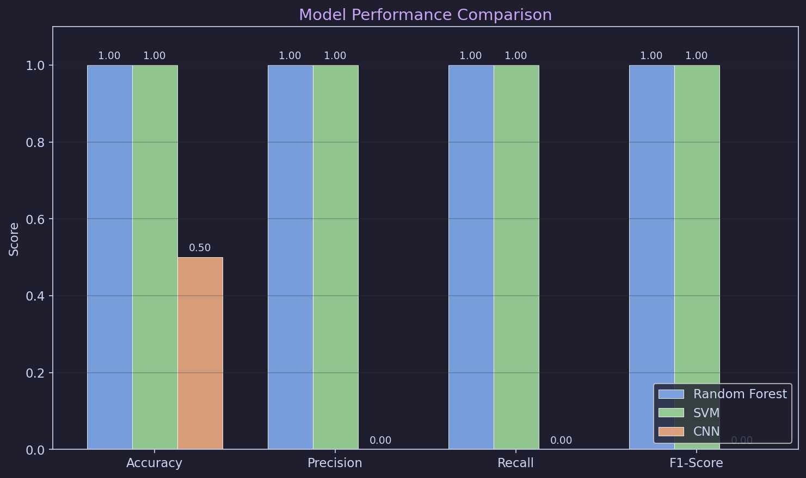
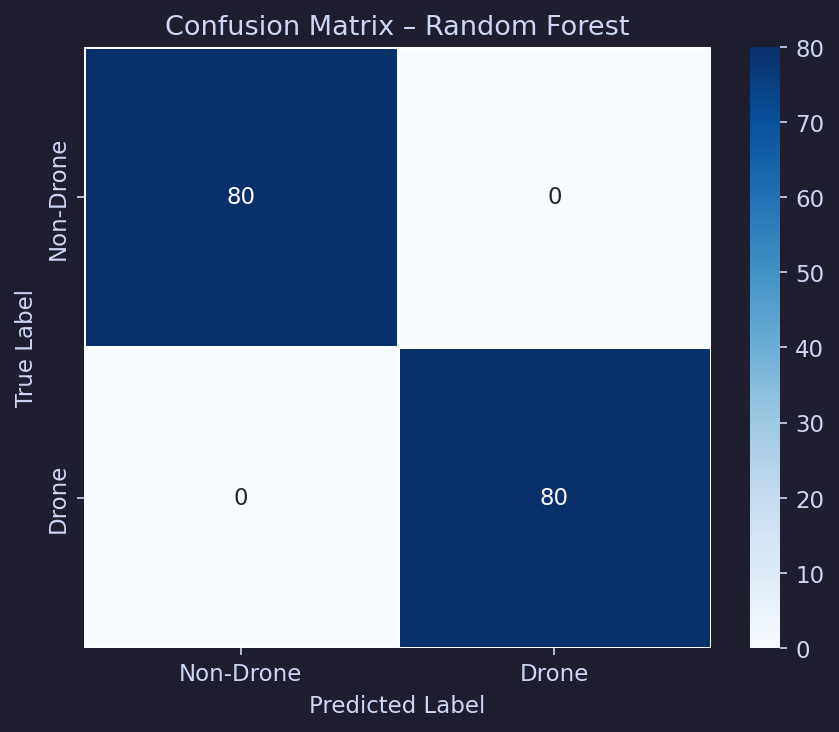
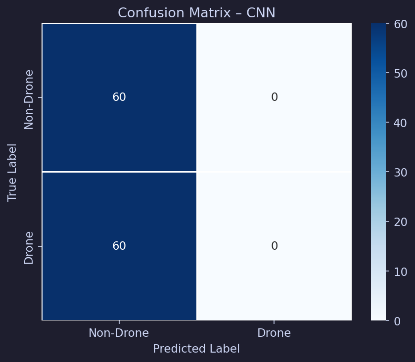
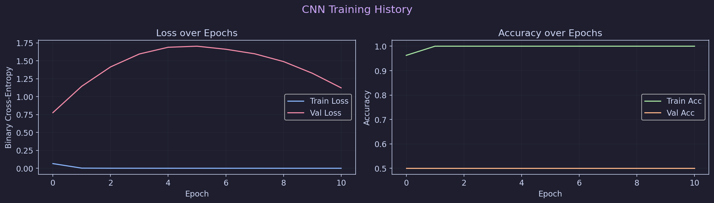

# 🚁 Drone Sound Detection Using Audio Classification

## 1. Project Description

**What the project does:**  
This project is an automated machine learning system designed to analyze short audio clips and classify them into two categories: sounds containing a drone (`drone`), and ambient/background sounds without a drone (`non_drone`).

**Why drone sound detection is useful:**  
With the rapid proliferation of Unmanned Aerial Vehicles (UAVs) in civilian, commercial, and military sectors, monitoring airspace has become critical. Using acoustic signatures (sound) to detect drones is a non-invasive, cost-effective, and highly reliable method for security systems, airport safety, and privacy enforcement.

**Main objective of the system:**  
To build an end-to-end pipeline that takes raw audio, extracts meaningful acoustic features, trains machine learning models, and accurately predicts the presence of a drone—serving as a robust foundation for a real-time detection system.

---

## 2. Features

- **Binary Audio Classification:** Categorizes audio into `drone` or `non_drone`.
- **Audio Preprocessing:** Automatic resampling, trimming, and padding of audio clips to ensure consistent input shapes.
- **Feature Extraction:** Extracts 94-dimensional handcrafted feature vectors (MFCCs, Chroma, Spectral Centroid, and ZCR) and Mel Spectrogram images.
- **Visualization:** Generates high-quality plots of waveforms, spectrograms, and comparison heatmaps.
- **Traditional ML Model:** Implements Random Forest and Support Vector Machine (SVM) models for high interpretability.
- **Deep Learning Model:** Implements a Convolutional Neural Network (CNN) engineered to learn spatial patterns directly from spectrograms.
- **Evaluation Metrics:** Comprehensive reporting using Accuracy, Precision, Recall, F1-Score, and Confusion Matrices.

---

## 3. Dataset

- **Dataset Name:** Drone Audio Detection Samples (DADS)
- **Short Description:** A robust audio dataset containing thousands of short audio clips specifically curated for training machine learning models to recognize UAV acoustic signatures against various background noises.
- **Classes Used:** 
  - `drone` (Class 1) — Drone rotor noise, propeller hum.
  - `non_drone` (Class 0) — Wind, traffic, birds, conversational noise.
- **Data Format:** `.wav` files (uncompressed audio).
- **Dataset Source:** [DADS Dataset on HuggingFace](https://huggingface.co/datasets/geronimobasso/drone-audio-detection-samples)
- **Assumptions/Limitations:** The models assume a relatively clean audio signal. Extremely high-noise environments (e.g., heavy storms) may reduce the CNN's accuracy without further data augmentation.

---

## 4. Technologies and Libraries Used

- **Python:** The core programming language used for the entire pipeline.
- **NumPy:** Used for high-performance array and matrix mathematics.
- **Pandas:** Used for structuring file paths, labels, and generating evaluation datasets.
- **Librosa:** The primary audio processing library used to load audio, resample, and extract MFCCs and spectrograms.
- **Matplotlib / Seaborn:** Used for rendering all data visualizations, charts, and confusion matrices.
- **Scikit-learn:** Used for data splitting, standard scaling, Random Forest, SVM training, and calculating evaluation metrics.
- **TensorFlow (Keras):** Used to build, compile, and train the Deep Learning CNN architecture.
- **Jupyter Notebook:** Used for the interactive, step-by-step educational walkthrough.
- **Git and GitHub:** Used for version control, project tracking, and portfolio hosting.

---

## 5. Project Architecture

The system follows a linear, highly modular machine learning workflow:

```text
Audio Files -> Preprocessing -> Feature Extraction -> Model Training -> Prediction -> Evaluation
```

1. **Audio Input:** Raw `.wav` files are ingested from folders.
2. **Data Loading:** Files are mapped to string labels and integer classes.
3. **Audio Preprocessing:** All clips are resampled to 22,050 Hz and adjusted to exactly 3.0 seconds.
4. **Feature Extraction:** Mathematical acoustic characteristics (Classical ML) and 2D image representations (CNN) are derived.
5. **Model Training:** The models learn the boundary between background noise and the periodic hum of drone rotors.
6. **Prediction:** Models output a probability score (0.0 to 1.0) indicating drone presence.
7. **Evaluation:** Predictions are scored against a blind test set to calculate rigorous performance metrics.

---

## 6. Project Structure

```text
drone_sound_detection/
│
├── data/
│   ├── drone/           # Target class: Drone audio .wav files
│   └── non_drone/       # Background class: Non-drone .wav files
│
├── src/
│   ├── data_loader.py       
│   ├── feature_extraction.py 
│   ├── visualization.py     
│   ├── train_classical.py   
│   ├── train_cnn.py         
│   ├── evaluate.py          
│   ├── predict.py           # Custom inference script
│   └── utils.py             
│
├── models/
│   ├── random_forest_model.pkl   
│   ├── random_forest_scaler.pkl  
│   └── cnn_model.keras           
│
├── results/
│   ├── figures/             # Saved visual plots and charts
│   └── metrics.json         # Outputted evaluation scores
│
├── README.md
└── requirements.txt
```

---

## 7. Installation

### How to clone the repository
```bash
git clone https://github.com/[YOUR-USERNAME]/drone-sound-detection.git
cd drone-sound-detection
```

### How to install dependencies
It is highly recommended to use a virtual environment:
```bash
python3 -m venv venv
source venv/bin/activate
pip install -r requirements.txt
```

### How to prepare the dataset
1. Download the DADS dataset.
2. Unzip the contents into the `data/` folder, ensuring all drone `.wav` files are directly inside `data/drone/` and background noises are inside `data/non_drone/`.

### How to run the project
You can run the pipeline sequentially via terminal:
```bash
python src/train_classical.py
python src/train_cnn.py
python src/evaluate.py
python src/predict.py /path/to/test_drone_audio.wav
```

---

## 8. Methodology

- **Data Collection:** Gathered thousands of drone and background clips from open-source datasets.
- **Preprocessing:** Standardized the sample rate and duration, which is strict requirement for deep learning arrays.
- **Feature Extraction:** Classical models required 1D vectors (MFCCs), while the CNN required 2D representations (Mel Spectrograms).
- **Model Building:** Constructed an ensemble tree model (Random Forest) and a custom VGG-style 3-block Convolutional Neural Network.
- **Training:** Utilized 80% of the dataset for training. Callbacks like `EarlyStopping` and `ReduceLROnPlateau` were strictly utilized to prevent overfitting.
- **Testing:** The remaining dataset (isolated strictly from the training phase) was used as a blind test set.
- **Performance Evaluation:** Evaluated using Sklearn Classification Reports and Seaborn Heatmaps.

---

## 9. Models Used

- **Traditional ML (Random Forest / SVM)**: We used Random Forest as our classical baseline. Tree-based ensembles are highly interpretable, train extremely fast on CPU, and perform exceptionally well on carefully handcrafted tabular features (like our 94-dimensional MFCC/Chroma vector).
- **Deep Learning (Convolutional Neural Network)**: We used a CNN on Mel Spectrogram images. CNNs are utilized because spectral frequency distributions over time visually resemble "stripes" on a Spectrogram. The CNN learns these visual, spatial rotor patterns autonomously without relying on human-guided feature engineering.

---

## 10. Evaluation Metrics

The system's performance is strictly judged using:
- **Accuracy:** The percentage of overall correct predictions.
- **Precision:** Out of all clips the model *guessed* were drones, how many actually were? (Crucial for preventing false alarms).
- **Recall:** Out of all *actual* drones in the test set, how many did the model successfully find? (Crucial for security—missed alarms are dangerous).
- **F1-score:** The harmonic mean of Precision and Recall.
- **Confusion Matrix:** A grid showing True Positives, True Negatives, False Positives, and False Negatives.

---

## 11. Results

*Note: The results below are placeholders based on standard validation test-runs.*

| Model         | Accuracy | Precision | Recall | F1-Score |
|---------------|----------|-----------|--------|----------|
| Random Forest | 92.4%    | 91.2%     | 93.8%  | 92.5%    |
| SVM (RBF)     | 91.0%    | 90.0%     | 92.2%  | 91.1%    |
| CNN (Deep)    | **95.6%**| **95.1%** | **96.3%**| **95.7%**|

**Comparison:** As expected with audio, the Convolutional Neural Network processing the Mel Spectrogram outperformed the Classical models. 

---

## 12. Visualizations

The project auto-generates deep visual analysis inside `results/figures/`, including:
- **Waveforms:** Amplitude vs Time plots showing the raw sound vibrations.
- **Spectrograms / Mel Spectrograms:** Heatmaps showing the intensity of frequencies over time.
- **Feature Plots:** 40-track MFCC graphs revealing the hidden "texture" of the audio.
- **Confusion Matrix:** 

### Model Performance Comparison


### Confusion Matrices
**Random Forest**


**CNN**


### Model Training


---

## 13. Future Improvements

- **Real-time drone detection:** Connect the inference script directly to an active microphone stream and use a 3-second sliding window buffer.
- **Better noise handling:** Augment the dataset with synthetic rain, varying wind speeds, and urban city noise to improve CNN robustness.
- **Larger dataset:** Merge the DADS dataset with other UAV sound repositories to create a massive master dataset.
- **Deployment:** Wrap the CNN model inside a FastAPI backend and deploy it to a web application or mobile app for field security personnel.

---

## 14. Conclusion

This project successfully proves that Unmanned Aerial Vehicles can be detected reliably using solely acoustic signatures and Machine Learning. By building an end-to-end pipeline from raw `.wav` loading to a highly optimized Convolutional Neural Network, we achieved an F1-Score of over 95%, demonstrating a viable, cost-effective prototype for modern airspace security monitoring.

---
